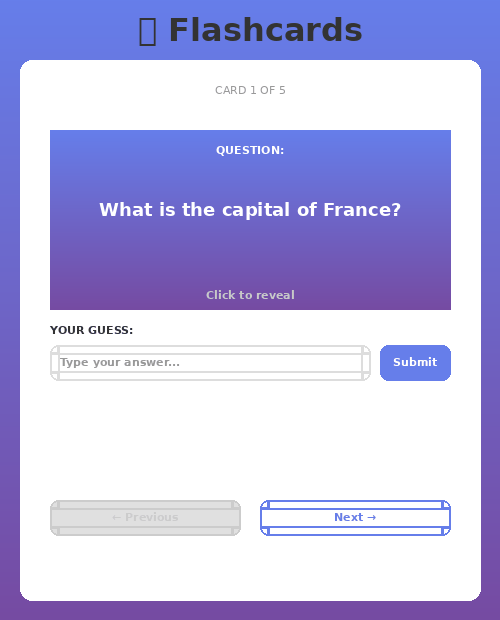

# Flashcards! - Study App

Submitted by: **Eloy Beaucejour**

This web app is an interactive flashcard study tool that allows users to learn, quiz themselves, and master information through an engaging card-based interface. Users can study various topics by guessing answers to questions, receiving instant feedback, and navigating through a deck of cards at their own pace.

Time spent: **3** hours spent in total

## Required Features

The following **required** functionality is completed:

- [x] **The user can enter their guess into an input box *before* seeing the flipside of the card**
  - Application features a clearly labeled input box with a submit button where users can type in a guess
  - Clicking on the submit button with an **incorrect** answer shows visual feedback that it is wrong (❌ Incorrect message with red background)
  - Clicking on the submit button with a **correct** answer shows visual feedback that it is correct (✅ Correct! message with green background)
- [x] **The user can navigate through an ordered list of cards**
  - A forward/next button displayed on the card navigates to the next card in a set sequence when clicked
  - A previous/back button displayed on the card returns to the previous card in the set sequence when clicked
  - Both the next and back buttons have visual indication that the user is at the beginning or end of the list (buttons are grayed out and disabled), preventing wrap-around navigation
  - Card progress counter displays "Card X of Y" to show current position

The following **optional** features are implemented:


- [x] Users can use a shuffle button to randomize the order of the cards
  - Cards should remain in the same sequence (**NOT** randomized) unless the shuffle button is clicked 
  - Cards should change to a random sequence once the shuffle button is clicked
- [x] A user's answer may be counted as correct even when it is slightly different from the target answer
  - Answers are considered correct even if they only partially match the answer on the card 
  - Examples: ignoring uppercase/lowercase discrepancies, ignoring punctuation discrepancies, matching only for a particular part of the answer rather than the whole answer
- [x] A counter displays the user's current and longest streak of correct responses
  - The current counter increments when a user guesses an answer correctly
  - The current counter resets to 0 when a user guesses an answer incorrectly
  - A separate counter tracks the longest streak, updating if the value of the current streak counter exceeds the value of the longest streak counter 
- [ ] A user can mark a card that they have mastered and have it removed from the pool of displayed cards
  - The user can mark a card to indicate that it has been mastered
  - Mastered cards are removed from the pool of displayed cards and added to a list of mastered cards


The following **additional** features are implemented:

* [x] Smooth 3D card flip animation with perspective
* [x] Beautiful gradient UI with modern styling
* [x] Responsive design that works on mobile and desktop
* [x] Instant visual feedback with animations
* [x] Clean, organized React component architecture

## Video Walkthrough

Here's a walkthrough of implemented user stories:



## How to Run

```bash
# Install dependencies
npm install

# Start development server
npm run dev

# Open http://localhost:5174 in your browser
```

## How to Use

1. Read the question displayed on the purple card
2. Type your answer in the input box below the card
3. Click "Submit" to check your answer
4. You'll see immediate feedback (green for correct, red for incorrect)
5. Use the "Previous" and "Next" buttons to navigate through cards
6. The progress counter shows which card you're on

## Project Structure

```
src/
├── App.jsx                 # Main component with state management
├── App.css                 # App styling
├── index.jsx               # React entry point
├── index.css               # Global styles and gradients
└── components/
    ├── Card.jsx            # Flashcard with 3D flip animation
    ├── Card.css
    ├── GuessingBox.jsx     # Input and feedback component
    ├── GuessingBox.css
    ├── Navigation.jsx      # Previous/Next controls
    └── Navigation.css
```

## Customization

### Change Flashcard Data
Edit the `cards` array in `src/App.jsx`:

```javascript
const [cards] = useState([
  { id: 1, question: 'What is the capital of France?', answer: 'Paris' },
  { id: 2, question: 'What is 2 + 2?', answer: '4' },
  // Add your questions and answers here
])
```

### Add Stretch Features
See `SETUP.md` for detailed guides on implementing:
- Fuzzy matching for answers
- Shuffle button
- Streak counter
- Card mastery tracking

## Technologies Used

- **React 18** - UI framework with hooks
- **Vite** - Fast build tool and dev server
- **CSS3** - Animations and gradients
- **JavaScript ES6+** - Modern JavaScript features

## Creating Your GIF Walkthrough

To create a GIF of your app for submission, use one of these tools:

**macOS:**
- [Kap](https://getkap.co/) - Free and simple
- [ScreenFlow](https://www.screenflow.com/) - Professional option

**Windows:**
- [ScreenToGif](https://www.screentogif.com/) - Free and easy
- [ShareX](https://getsharex.com/) - Advanced features

**Linux:**
- [Peek](https://github.com/phw/peek) - Lightweight
- [SimpleScreenRecorder](https://www.maartenbaert.be/simplescreenrecorder/)

**Online Tools:**
- [ezgif.com](https://ezgif.com/) - Web-based, no installation needed

**Steps to record:**
1. Start the dev server: `npm run dev`
2. Open http://localhost:5174 in your browser
3. Record your screen showing:
   - Reading a question
   - Typing an answer
   - Submitting and seeing feedback
   - Navigating to previous/next cards
4. Save as GIF and place in project root as `flashcards-demo.gif`

## Notes

This project demonstrates core React concepts including:
- State management with `useState()` hook for tracking current card, flip status, and guess results
- Component composition with separate Card, GuessingBox, and Navigation components
- Event handling with `onClick` and `onChange` handlers
- CSS animations and 3D transforms for engaging UI
- Conditional rendering based on app state

## License

    Copyright 2026 Eloy Beaucejour

    Licensed under the Apache License, Version 2.0 (the "License");
    you may not use this file except in compliance with the License.
    You may obtain a copy of the License at

        http://www.apache.org/licenses/LICENSE-2.0

    Unless required by applicable law or agreed to in writing, software
    distributed under the License is distributed on an "AS IS" BASIS,
    WITHOUT WARRANTIES OR CONDITIONS OF ANY KIND, either express or implied.
    See the License for the specific language governing permissions and
    limitations under the License.